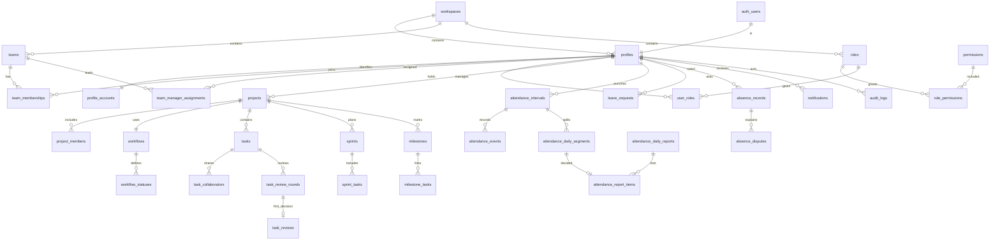

# ERD

نمودار زیر رابطه جدول‌های کاری است. جزئیات ستون در `database-schema.md` است.

```mermaid
erDiagram
  workspaces ||--o{ profiles : contains
  workspaces ||--o{ teams : contains
  workspaces ||--o{ roles : contains
  auth_users ||--|| profiles : is
  profiles ||--|| profile_accounts : identifies
  profiles ||--o{ team_memberships : joins
  teams ||--o{ team_memberships : has
  teams ||--o{ team_manager_assignments : leads
  profiles ||--o{ team_manager_assignments : assigned
  roles ||--o{ role_permissions : grants
  permissions ||--o{ role_permissions : included
  profiles ||--o{ user_roles : holds
  roles ||--o{ user_roles : given
  profiles ||--o{ projects : manages
  projects ||--o{ project_members : includes
  projects ||--|| workflows : uses
  workflows ||--o{ workflow_statuses : defines
  projects ||--o{ tasks : contains
  tasks ||--o{ task_collaborators : shares
  tasks ||--o{ task_review_rounds : reviews
  task_review_rounds ||--o| task_reviews : first_decision
  projects ||--o{ sprints : plans
  sprints ||--o{ sprint_tasks : includes
  projects ||--o{ milestones : marks
  milestones ||--o{ milestone_tasks : links
  profiles ||--o{ attendance_intervals : punches
  attendance_intervals ||--o{ attendance_events : records
  attendance_intervals ||--o{ attendance_daily_segments : splits
  attendance_daily_reports ||--o{ attendance_report_items : lists
  attendance_daily_segments ||--o| attendance_report_items : decided
  profiles ||--o{ leave_requests : asks
  profiles ||--o{ absence_records : noted
  absence_records ||--o{ absence_disputes : explains
  profiles ||--o{ notifications : receives
  profiles ||--o{ audit_logs : acts
```

`auth_users` همان `auth.users` سوپابیس است و در مهاجرت جدول‌های برنامه ساخته نمی‌شود.
